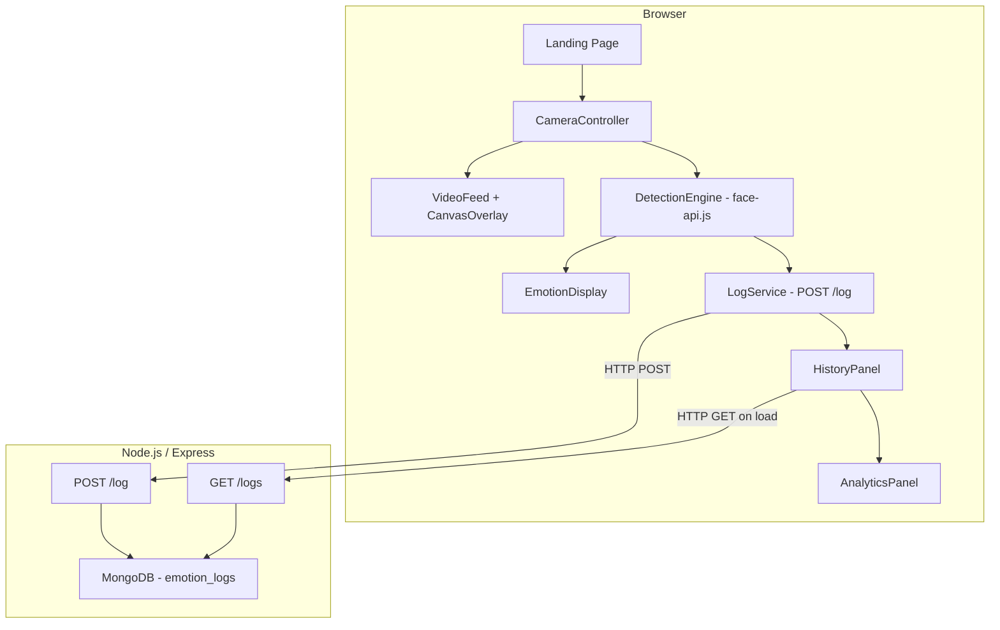

# Design Document: Beauty Insight Studio

## Overview

Beauty Insight Studio is a full-stack web application that performs real-time facial emotion detection via the browser webcam, presents results with a luxury beauty-parlor aesthetic, persists emotion logs to a MongoDB backend, and surfaces session analytics. The system is split into two independently deployable units:

- **Frontend**: React (Vite) SPA with Tailwind CSS, Framer Motion, and face-api.js running entirely in-browser.
- **Backend**: Node.js/Express REST API backed by MongoDB Atlas (or local MongoDB).

All AI inference runs client-side using face-api.js, so no video data ever leaves the user's device. The backend only receives the classified emotion label and a timestamp.

### Key Design Decisions

- **Client-side inference**: Keeps video private, eliminates server-side GPU requirements, and reduces latency.
- **Lazy model loading**: face-api.js model weights (~6 MB total) are fetched only after the user explicitly starts the camera, keeping initial page load fast.
- **2-second detection floor**: Prevents CPU/GPU saturation on lower-end devices while still feeling responsive.
- **Optimistic UI with silent retry**: Emotion logs are appended to the UI immediately; a single silent POST retry handles transient network blips without interrupting the UX.

---

## Architecture



### Data Flow

1. User clicks "Start Camera" → browser requests `getUserMedia` permission.
2. On grant, `CameraController` triggers lazy import of face-api.js and model fetch.
3. Once models are ready, a `setInterval` (≥2 s) fires `DetectionEngine.analyze()`.
4. `analyze()` runs `faceapi.detectSingleFace().withFaceLandmarks().withFaceExpressions()`.
5. Dominant emotion + confidence extracted → `EmotionDisplay` updated → `POST /log` fired.
6. Backend persists to MongoDB, returns 201.
7. `HistoryPanel` prepends the new entry; `AnalyticsPanel` increments the session counter.

---

## Components and Interfaces

### Frontend Components

#### `App`
Root component. Owns global state (camera active, model status, emotion logs, session counts). Renders `LandingHero`, `CameraController`, `HistoryPanel`, `AnalyticsPanel`.

#### `LandingHero`
Displays title, subtitle, rotating quote carousel (4 s interval), and animated particle background. Renders the "Start Camera" / "Stop Camera" button.

#### `CameraController`
Manages `getUserMedia` lifecycle. Exposes `start()` / `stop()` actions. Renders `<video>` element and `<canvas>` overlay. Delegates to `DetectionEngine`.

#### `DetectionEngine` (custom hook: `useDetectionEngine`)
```ts
interface DetectionResult {
  emotion: EmotionLabel;
  confidence: number;          // 0–1
  boundingBox: BoundingBox;
}

type EmotionLabel =
  | 'happy' | 'sad' | 'angry' | 'surprised'
  | 'neutral' | 'fearful' | 'disgusted';

interface BoundingBox {
  x: number; y: number; width: number; height: number;
}

interface UseDetectionEngineReturn {
  status: 'idle' | 'loading' | 'ready' | 'error';
  errorMessage: string | null;
  lastResult: DetectionResult | null;
  noFaceDetected: boolean;
  start: (videoEl: HTMLVideoElement, canvasEl: HTMLCanvasElement) => void;
  stop: () => void;
  retry: () => void;
}
```

#### `EmotionDisplay`
Animated card showing current emotion label, confidence %, and emotion-mapped accent glow. Uses Framer Motion `AnimatePresence` for fade/slide on emotion change.

#### `HistoryPanel`
Scrollable `Glass_Card` listing up to 100 `EmotionLog` entries. Prepends new entries with slide-in animation. Shows inline error + retry on `GET /logs` failure.

#### `AnalyticsPanel`
`Glass_Card` with a simple bar chart (CSS or lightweight charting) showing per-emotion counts for the current session. Updates reactively from shared state.

#### `ToastNotification`
Non-blocking overlay for inference errors. Auto-dismisses after 4 s.

#### `LoadingOverlay`
Shown during model loading. Displays animated spinner + status label ("Loading face detection models…").

### Backend Modules

#### `server.js`
Express entry point. Connects to MongoDB, registers routes, starts HTTP listener.

#### `routes/logs.js`
```
POST /log   → logsController.create
GET  /logs  → logsController.list
```

#### `controllers/logsController.js`
- `create(req, res)`: validates `emotion` + `timestamp`, inserts document, returns 201.
- `list(req, res)`: queries collection sorted `{ timestamp: -1 }`, returns JSON array.

#### `models/EmotionLog.js` (Mongoose schema)
See Data Models section.

---

## Data Models

### Frontend State

```ts
// Global app state (React context or Zustand store)
interface AppState {
  cameraActive: boolean;
  modelStatus: 'idle' | 'loading' | 'ready' | 'error';
  modelError: string | null;
  currentEmotion: DetectionResult | null;
  noFaceDetected: boolean;
  logs: EmotionLog[];          // capped at 100, newest first
  sessionCounts: Record<EmotionLabel, number>;
  logsError: string | null;
}
```

### `EmotionLog` (shared shape)

```ts
interface EmotionLog {
  _id?: string;                // MongoDB ObjectId (string after serialization)
  emotion: EmotionLabel;
  confidence: number;          // stored as 0–1 float
  timestamp: string;           // ISO 8601
}
```

### MongoDB Document (`emotion_logs` collection)

```js
{
  _id:        ObjectId,
  emotion:    String,   // enum: happy|sad|angry|surprised|neutral|fearful|disgusted
  confidence: Number,   // 0–1
  timestamp:  Date,     // indexed for sort performance
  createdAt:  Date      // auto via Mongoose timestamps
}
```

Mongoose schema:

```js
const emotionLogSchema = new Schema(
  {
    emotion: {
      type: String,
      enum: ['happy','sad','angry','surprised','neutral','fearful','disgusted'],
      required: true,
    },
    confidence: { type: Number, min: 0, max: 1 },
    timestamp:  { type: Date, required: true, index: true },
  },
  { timestamps: true }
);
```

### API Payloads

**POST /log request body**
```json
{ "emotion": "happy", "confidence": 0.94, "timestamp": "2024-01-15T10:30:00.000Z" }
```

**POST /log response (201)**
```json
{ "id": "65a1b2c3d4e5f6a7b8c9d0e1" }
```

**POST /log response (400)**
```json
{ "error": "Missing required fields: emotion, timestamp" }
```

**GET /logs response (200)**
```json
[
  { "_id": "...", "emotion": "happy", "confidence": 0.94, "timestamp": "2024-01-15T10:30:00.000Z" },
  ...
]
```


---

## Correctness Properties

*A property is a characteristic or behavior that should hold true across all valid executions of a system — essentially, a formal statement about what the system should do. Properties serve as the bridge between human-readable specifications and machine-verifiable correctness guarantees.*

### Property 1: Detection interval floor

*For any* active detection session, the detection function shall never be invoked at an interval shorter than 2000ms, regardless of how fast the previous inference completed.

**Validates: Requirements 2.1, 10.2**

---

### Property 2: Detection result always yields a valid emotion label

*For any* video frame in which a face is detected, the returned emotion label must be one of the seven known values: `happy`, `sad`, `angry`, `surprised`, `neutral`, `fearful`, `disgusted`.

**Validates: Requirements 2.2, 2.3, 11.4**

---

### Property 3: Detection result confidence is a valid probability

*For any* detection result, the `confidence` value must be a number in the closed interval [0, 1].

**Validates: Requirements 2.3**

---

### Property 4: Emotion-to-accent-color mapping is total and correct

*For any* emotion label from the known set, the UI accent color applied must match the specified mapping (happy → yellow, sad → blue, angry → red, surprised → orange, neutral → lavender, fearful → purple, disgusted → green), and no unknown label shall produce a valid color mapping.

**Validates: Requirements 2.7**

---

### Property 5: POST /log payload always includes emotion and ISO 8601 timestamp

*For any* detection result that triggers a log POST, the request body must contain a non-empty `emotion` string and a `timestamp` string that is a valid ISO 8601 date-time.

**Validates: Requirements 4.1**

---

### Property 6: Server returns 201 for all valid POST /log requests

*For any* POST /log request body containing a valid `emotion` (from the known enum) and a valid ISO 8601 `timestamp`, the API server must respond with HTTP 201 and persist the document.

**Validates: Requirements 4.2, 9.1**

---

### Property 7: Server returns 400 for all incomplete POST /log requests

*For any* POST /log request body that is missing `emotion`, missing `timestamp`, or both, the API server must respond with HTTP 400 and must not persist any document.

**Validates: Requirements 4.3**

---

### Property 8: GET /logs returns logs in descending timestamp order

*For any* set of Emotion_Log documents in the database, GET /logs must return them ordered such that for every adjacent pair `(logs[i], logs[i+1])`, `logs[i].timestamp >= logs[i+1].timestamp`.

**Validates: Requirements 4.4, 9.2**

---

### Property 9: New log is always prepended to the history list

*For any* existing history list and any new Emotion_Log added to it, the new entry must appear at index 0 of the displayed list.

**Validates: Requirements 5.2**

---

### Property 10: Each rendered log entry contains all required fields

*For any* Emotion_Log in the history list, the rendered HTML for that entry must contain the emotion label, the confidence score formatted as a percentage, and the formatted timestamp.

**Validates: Requirements 5.3**

---

### Property 11: History list is capped at 100 entries

*For any* history list of length N > 100, the number of entries rendered in the UI must be exactly 100, and they must be the 100 most recent entries.

**Validates: Requirements 5.4**

---

### Property 12: Session counts accurately reflect log history

*For any* list of Emotion_Logs in the current session, the count displayed for each emotion label in the Analytics_Panel must equal the number of logs in the list with that label.

**Validates: Requirements 6.1**

---

### Property 13: CORS header present on all API responses

*For any* HTTP request to the API server from the configured frontend origin, the response must include an `Access-Control-Allow-Origin` header that permits that origin.

**Validates: Requirements 9.5**

---

### Property 14: Unknown emotion labels from API are rejected before render

*For any* Emotion_Log received from the API whose `emotion` field is not in the known set of seven labels, the App must not render that entry in the history list or count it in the analytics.

**Validates: Requirements 11.4**

---

## Error Handling

### Frontend Error States

| Scenario | Trigger | UI Response |
|---|---|---|
| Browser lacks `getUserMedia` | `navigator.mediaDevices` undefined | Full-page message + recommended browser list |
| Camera permission denied | `getUserMedia` rejects with `NotAllowedError` | Inline error below "Start Camera" button |
| Model load failure | `faceapi.loadXxxModel` rejects | `LoadingOverlay` replaced with error + retry button |
| Inference runtime error | `detectSingleFace` throws | Console error + auto-dismiss toast; detection loop continues |
| `GET /logs` failure on load | fetch rejects or non-2xx | Inline error in `HistoryPanel` + retry button |
| `POST /log` failure | fetch rejects | Silent retry once; console warning if retry also fails |

### Backend Error Handling

- **MongoDB connection failure**: `mongoose.connect` rejection → `console.error` + `process.exit(1)`.
- **Validation error (400)**: Missing `emotion` or `timestamp` → `{ error: "Missing required fields: emotion, timestamp" }`.
- **Unexpected server error (500)**: Express error middleware catches unhandled errors, returns `{ error: "Internal server error" }` without leaking stack traces.
- **Request timeout**: All DB operations wrapped with a 1.5 s timeout to stay within the 2 s SLA.

### Retry Strategy

- POST /log: one automatic retry after 1 s delay using `setTimeout`. No exponential backoff (single retry only per requirement).
- GET /logs: no automatic retry; user-initiated via retry button.

---

## Testing Strategy

### Dual Testing Approach

Both unit tests and property-based tests are required. They are complementary:
- **Unit tests** verify specific examples, integration points, and error paths.
- **Property-based tests** verify universal invariants across randomized inputs.

### Property-Based Testing

**Library**: [fast-check](https://github.com/dubzzz/fast-check) (TypeScript/JavaScript, works with Vitest).

Each property-based test must:
- Run a minimum of **100 iterations** (fast-check default is 100; set `numRuns: 100` explicitly).
- Include a comment tag in the format: `// Feature: beauty-insight-studio, Property N: <property_text>`
- Be implemented as a **single** `fc.assert(fc.property(...))` call per design property.

**Property test mapping:**

| Design Property | Test Description | Arbitraries |
|---|---|---|
| P1: Detection interval floor | Verify `setInterval` is never called with < 2000ms | `fc.integer({ min: 0, max: 10000 })` for elapsed time |
| P2: Valid emotion label | For any mocked faceapi result, returned label is in known set | `fc.record` with random expression scores |
| P3: Confidence in [0,1] | For any mocked result, confidence is in [0,1] | `fc.record` with random float scores |
| P4: Emotion-color mapping | For any known label, correct color token returned | `fc.constantFrom(...emotionLabels)` |
| P5: POST payload shape | For any DetectionResult, POST body has valid emotion + ISO timestamp | `fc.record` with emotion + confidence |
| P6: Server 201 on valid | For any valid emotion+timestamp, server returns 201 | `fc.constantFrom(...labels)` + `fc.date()` |
| P7: Server 400 on invalid | For any payload missing required fields, server returns 400 | `fc.record` with optional fields omitted |
| P8: GET /logs ordering | For any inserted log set, response is timestamp-descending | `fc.array(fc.record(...))` |
| P9: New log prepended | For any list + new log, new log is at index 0 | `fc.array(...)` + `fc.record(...)` |
| P10: Log entry renders all fields | For any EmotionLog, rendered output contains label, %, timestamp | `fc.record(...)` |
| P11: History capped at 100 | For any list of N > 100, rendered count = 100 | `fc.array(..., { minLength: 101, maxLength: 200 })` |
| P12: Session counts accurate | For any log array, counts match label frequency | `fc.array(fc.constantFrom(...labels))` |
| P13: CORS header present | For any request to API, response has CORS header | `fc.constantFrom(...methods)` |
| P14: Unknown labels rejected | For any unknown emotion string, entry not rendered | `fc.string()` filtered to exclude known labels |

### Unit Test Coverage

Focus unit tests on:
- **CameraController**: `getUserMedia` success/failure paths, stream release on stop, unsupported browser detection.
- **DetectionEngine hook**: model loading states (idle → loading → ready → error), lazy-load not triggered before start.
- **HistoryPanel**: `GET /logs` on mount, inline error + retry button on failure, correct rendering of log entries.
- **LogService**: silent retry on POST failure (called twice, no UI error), no POST when no face detected.
- **API routes**: 201 on valid POST, 400 on missing fields, GET returns array.
- **App unmount**: timers cleared, stream released, pending requests cancelled.

### Test File Structure

```
frontend/
  src/
    hooks/__tests__/useDetectionEngine.test.ts
    components/__tests__/HistoryPanel.test.tsx
    components/__tests__/AnalyticsPanel.test.tsx
    components/__tests__/CameraController.test.tsx
    services/__tests__/logService.test.ts
    utils/__tests__/emotionUtils.test.ts
  src/
    __property_tests__/
      detectionEngine.property.test.ts
      historyPanel.property.test.ts
      emotionUtils.property.test.ts

backend/
  src/
    routes/__tests__/logs.test.ts
    controllers/__tests__/logsController.test.ts
  src/
    __property_tests__/
      logsApi.property.test.ts
```

**Test runner**: Vitest (frontend), Jest or Vitest (backend).
**Minimum coverage target**: 80% line coverage on business logic modules.
